# HRMS Frontend - Professional Human Resource Management System

A comprehensive **Human Resource Management System (HRMS)** frontend built with **React.js**, **Tailwind CSS**, and **React Icons**. This is a fully functional HRMS application with modern UI/UX, state management, and professional features for managing employees, attendance, leave, payroll, and performance.

---

## 🎯 Features

### 🔐 Authentication & Security
- Secure login system with multiple test credentials
- Role-based access control (Admin, HR, Employee)
- Private route protection
- Session management with localStorage
- Logout functionality

### 👥 Employee Management
- Comprehensive employee list with search and filtering
- Add new employees with detailed information
- View employee details (salary, department, position, join date)
- Edit and delete employee records
- Department-wise filtering
- Export employee data

### 📅 Attendance Tracking
- Real-time attendance status (Present, Absent, Late, Half Day)
- Mark attendance with check-in/check-out times
- View attendance history
- Monthly attendance trends
- Filter by employee or department
- Attendance statistics dashboard

### 📝 Leave Management
- Request leave with multiple types (Sick, Vacation, Personal, Casual, Maternity)
- View personal leave balance
- Track leave requests (Approved, Pending, Rejected)
- Cancel leave requests
- Leave history
- Admin approval management

### 💰 Payroll Management
- Calculate and manage employee salaries
- Add allowances and deductions
- View net salary calculations
- Payroll status tracking (Paid, Pending)
- Export payroll reports
- Monthly payroll summaries

### ⭐ Performance Management
- Employee performance ratings (1-5 stars)
- Track productivity, quality, teamwork, communication
- Performance history and trends
- Give and receive feedback
- Performance status (Excellent, Good, Average)
- Individual and comparative performance analysis

### ⚙️ Settings
- **Profile Management**: Update personal information
- **Notifications**: Customize notification preferences
- **Security**: Change password with validation
- **Data Privacy**: Download data and account information

### 📊 Dashboard
- Key metrics and statistics
- Employee count, attendance status, leave requests
- Pending approvals count
- Recent activities timeline
- Department overview with employee distribution
- Quick statistics cards
- Visual data representation

---

## 🛠️ Technologies & Libraries

- **React.js** (v19.1.0) - UI framework
- **React Router** (v7.6.1) - Client-side routing
- **Tailwind CSS** (v3.4.17) - Utility-first CSS framework
- **React Icons** (v5.0.1) - Icon library
- **PostCSS** - CSS processing
- **Autoprefixer** - CSS vendor prefixing

---

## 📦 Installation & Setup

### Prerequisites
- Node.js (v14 or above)
- npm or yarn package manager

### Step 1: Clone the Repository
```bash
git clone https://github.com/Pooja2579/hrms-frontend.git
cd hrms-frontend/hrms-frontend
```

### Step 2: Install Dependencies
```bash
npm install
```

### Step 3: Start the Development Server
```bash
npm start
```

The application will open in your browser at `http://localhost:3000`

---

## 🔑 Test Credentials

Use these credentials to test the application:

| Email | Password | Role |
|-------|----------|------|
| admin@example.com | admin | Admin |
| hr@example.com | hr123 | HR Manager |
| emp@example.com | emp123 | Employee |

---

## 📁 Project Structure

```
hrms-frontend/
├── public/
│   └── index.html
├── src/
│   ├── components/
│   │   └── Sidebar.js          # Navigation sidebar with collapsible menu
│   ├── pages/
│   │   ├── Dashboard.js         # Main dashboard with metrics
│   │   ├── Employees.js         # Employee management
│   │   ├── Attendance.js        # Attendance tracking
│   │   ├── Leave.js             # Leave management
│   │   ├── Payroll.js           # Payroll management
│   │   ├── Performance.js       # Performance reviews
│   │   ├── Settings.js          # User settings
│   │   └── Login.js             # Authentication page
│   ├── App.js                   # Main app component
│   ├── App.css                  # Global styles
│   ├── PrivateRoute.js          # Route protection
│   ├── index.js                 # Entry point
│   └── index.css                # Tailwind imports
├── package.json
├── tailwind.config.js           # Tailwind configuration
├── postcss.config.js            # PostCSS configuration
└── README.md
```

---

## 🎨 UI/UX Features

### Design System
- **Color Scheme**: Blue primary, with green, yellow, and red accents
- **Typography**: Clean, modern font stack
- **Spacing**: Consistent padding and margins
- **Shadows**: Subtle shadows for depth
- **Transitions**: Smooth animations and hover effects

### Components
- Responsive cards with gradient backgrounds
- Filterable data tables with search
- Modal dialogs for forms
- Status badges with color coding
- Star ratings for performance
- Progress bars for attendance rates
- Navigation breadcrumbs

### Responsive Design
- Mobile-first approach
- Tailwind CSS responsive classes
- Collapsible sidebar for mobile
- Grid layouts that adapt to screen size
- Touch-friendly buttons and inputs

---

## 🚀 Available Scripts

### `npm start`
Runs the app in development mode at `http://localhost:3000`

### `npm build`
Builds the app for production to the `build` folder

### `npm test`
Launches the test runner

### `npm eject`
Ejects from Create React App configuration (irreversible)

---

## 🔄 State Management

The application uses:
- **React Hooks** (useState, useEffect) for local state
- **localStorage** for session persistence
- **React Router** for navigation state

Mock data is included for demonstration. For production, replace with API calls.

---

## 🔐 Security Considerations

- Credentials are stored in localStorage (use secure authentication for production)
- Private routes protect sensitive pages
- Password validation in settings
- Input validation on forms
- CORS-ready for backend integration

---

## 🔗 API Integration Ready

The application is structured to easily integrate with backend APIs:

Replace mock data fetch with API calls:
```javascript
// Example - Replace mock data with API
const response = await fetch('https://api.example.com/employees');
const data = await response.json();
```

---

## 📝 Future Enhancements

- [ ] Real database integration
- [ ] Email notifications
- [ ] Advanced analytics and reporting
- [ ] File upload for documents
- [ ] Bulk import/export
- [ ] Advanced search filters
- [ ] Dark mode
- [ ] Mobile app version
- [ ] Multi-language support
- [ ] Two-factor authentication

---

## 🤝 Contributing

Contributions are welcome! Please follow these steps:
1. Fork the repository
2. Create a feature branch (`git checkout -b feature/AmazingFeature`)
3. Commit changes (`git commit -m 'Add AmazingFeature'`)
4. Push to branch (`git push origin feature/AmazingFeature`)
5. Open a Pull Request

---

## 📄 License

This project is licensed under the MIT License - see LICENSE file for details.

---

## 👨‍💼 Author

**Pooja2579**

## 📧 Support

For issues and questions, please open an issue on GitHub or contact the development team.

---

## 🎓 Learning Resources

- [React Documentation](https://react.dev)
- [Tailwind CSS Documentation](https://tailwindcss.com/docs)
- [React Router Documentation](https://reactrouter.com)
- [React Icons Documentation](https://react-icons.github.io/react-icons)

---

**Last Updated**: May 2024  
**Version**: 1.0.0 - Professional Release

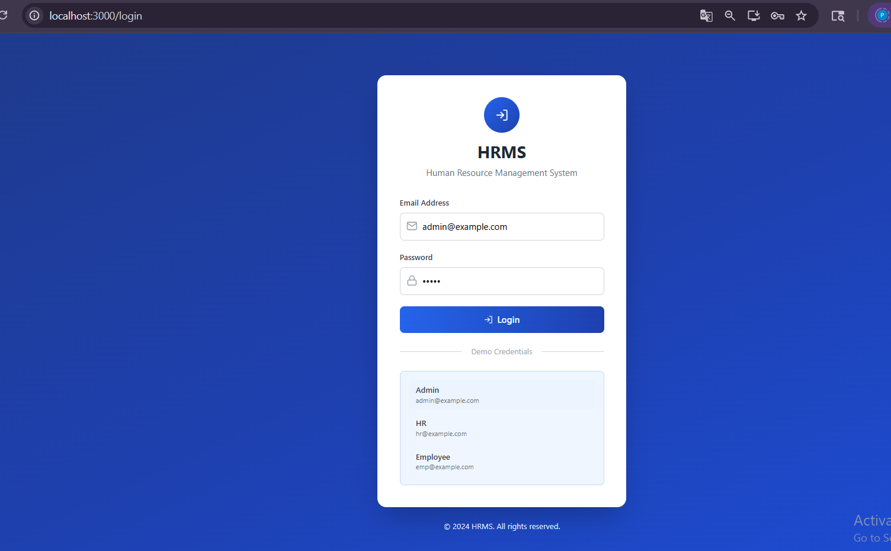

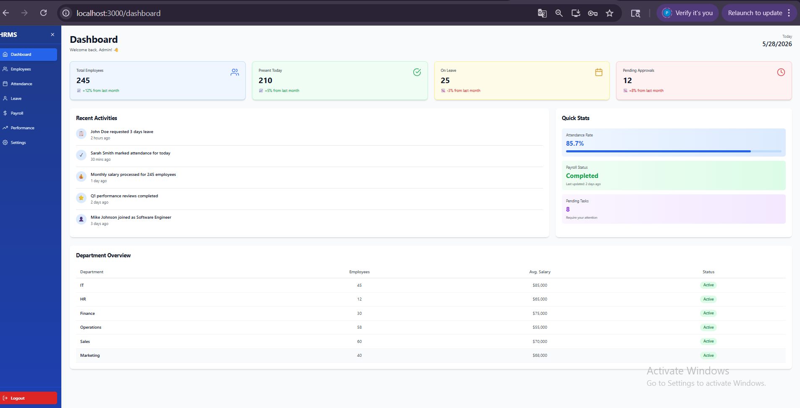

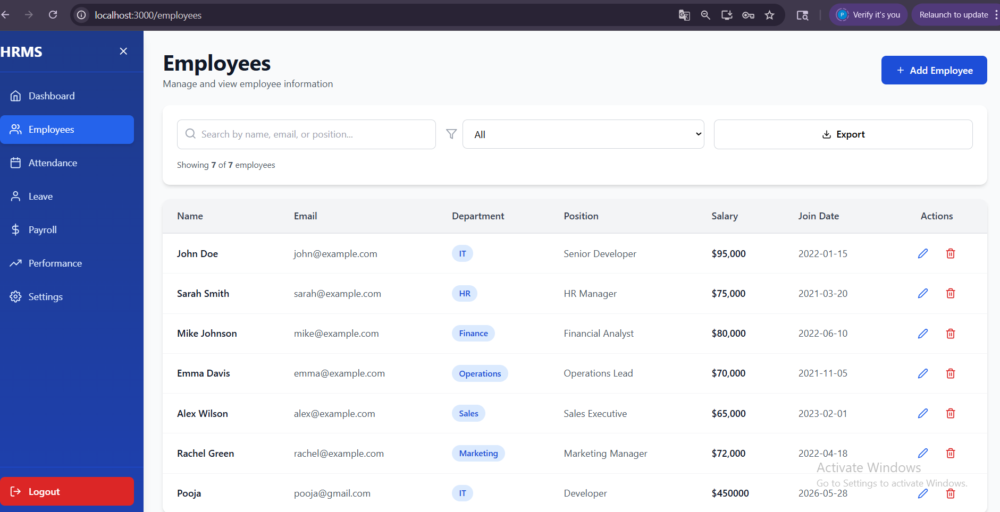

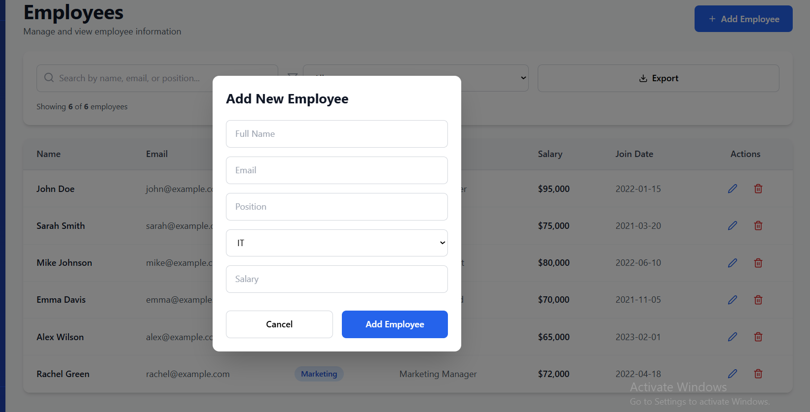

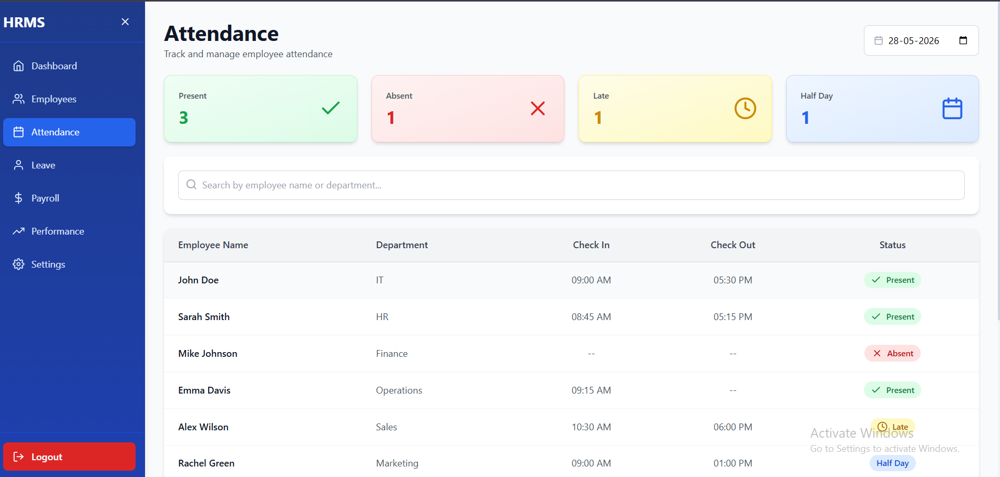

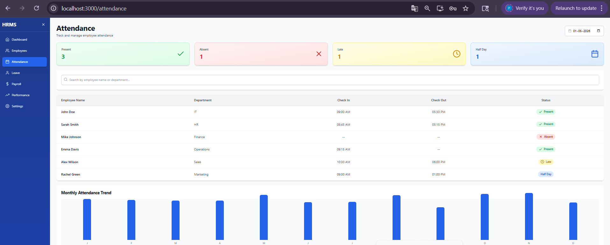

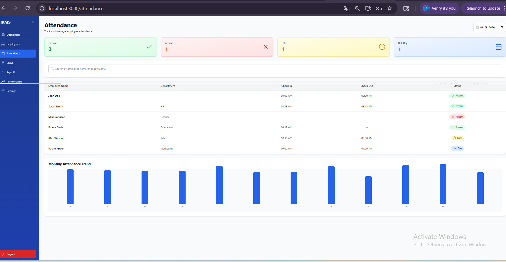

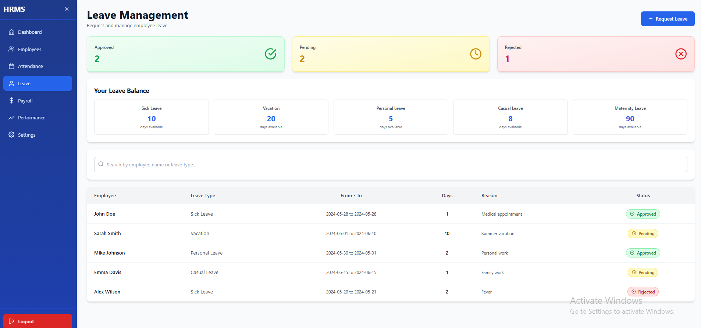

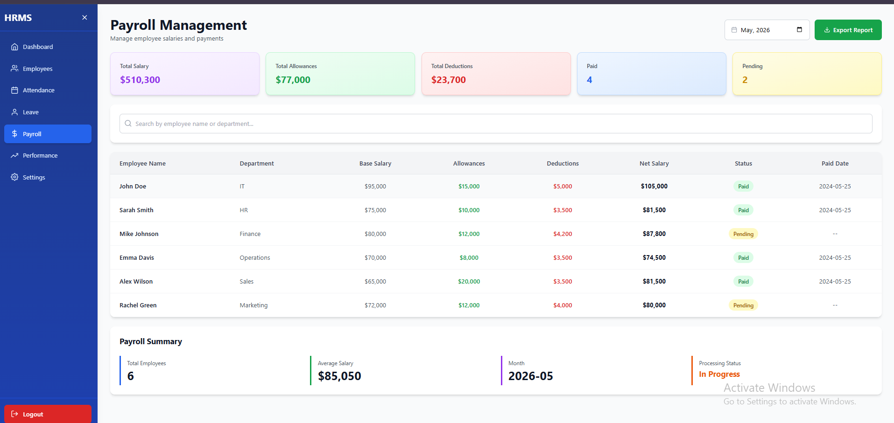


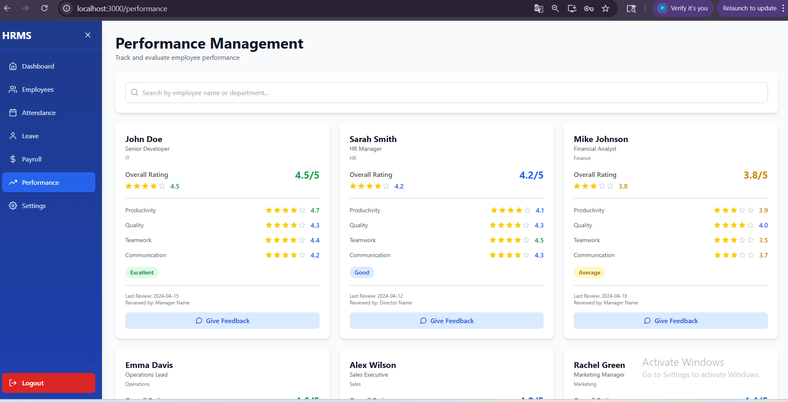

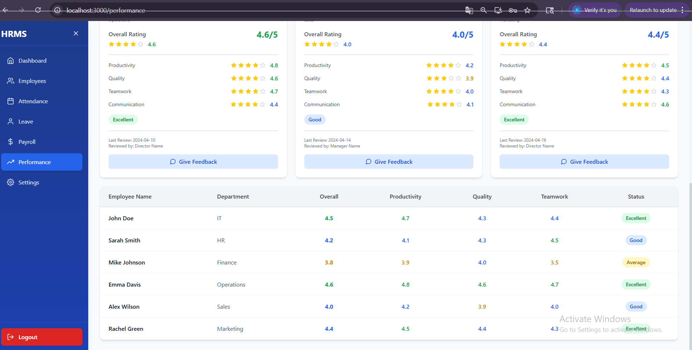


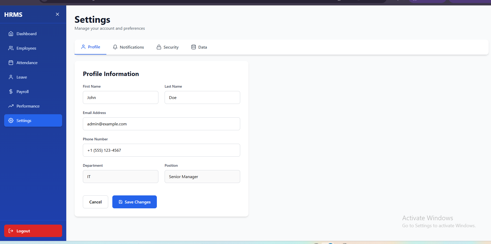

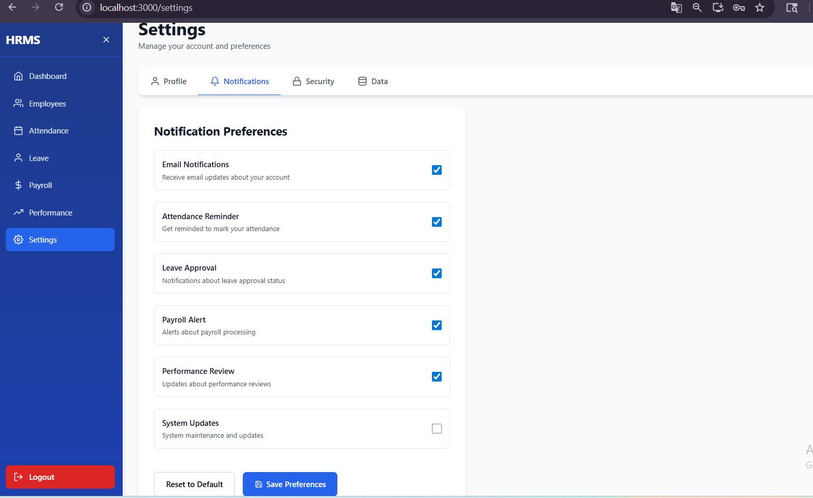

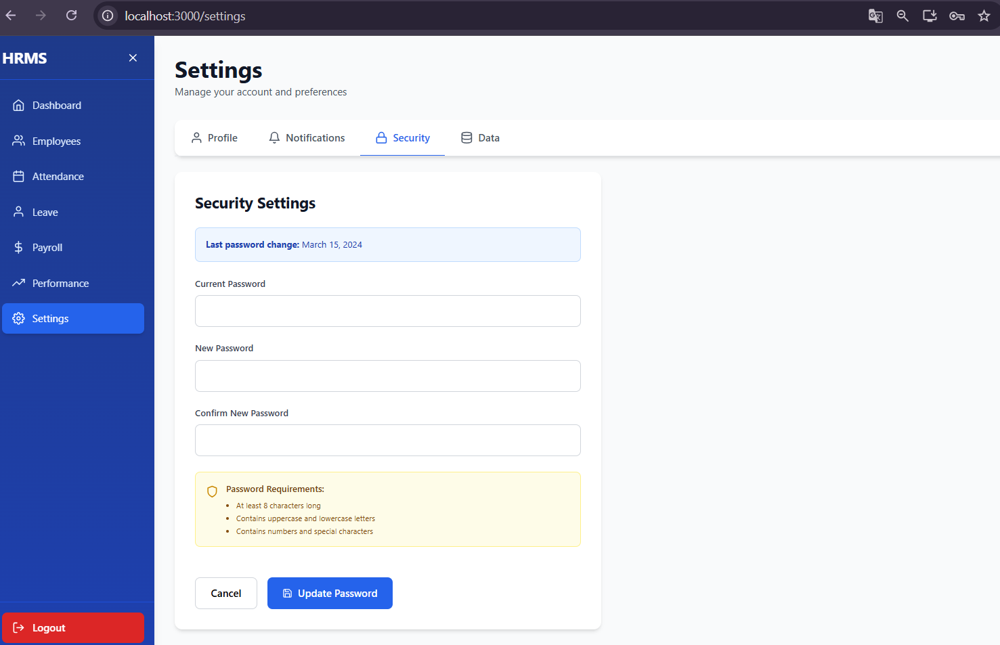


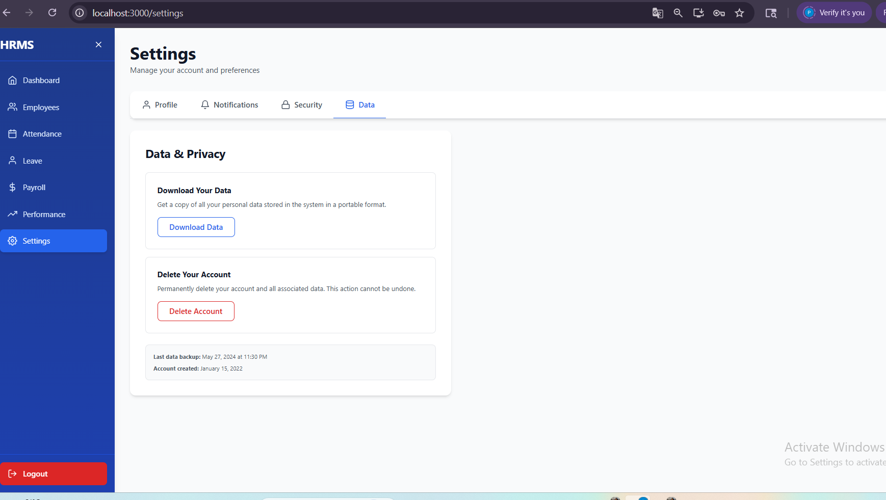